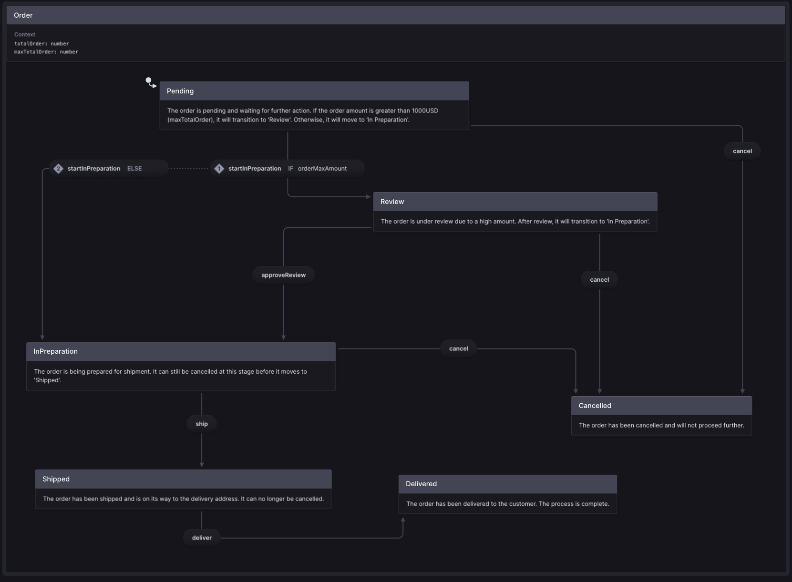

# JSMarket

[](http://commitizen.github.io/cz-cli/)
[](http://www.wtfpl.net/about/)


## Description
A modern e-commerce web application built with NestJS and React, using an Nx monorepo architecture.

## 🚀 Key Features
- 🛍️ Product catalog with search and filtering
- 🛒 Shopping cart
- 👤 User authentication
- 📦 Order management with state machine
- 💳 Checkout process
- 🎨 Modern UI with Tailwind CSS
- 🔒 Secure GraphQL API

## 🛠️ Tech Stack
- **Frontend**: React, Apollo Client, TailwindCSS
- **Backend**: NestJS, TypeORM, GraphQL
- **Testing**: Jest
- **Database**: SQLite

## Local Development

### 📋 Prerequisites
- Node.js v20 or higher
- npm v9 or higher

### 🔧 Setup Instructions

1. Clone the repository
2. Install dependencies
```bash
  npm install
```
4. Start the development servers

### 🚀 Running the app

```bash
  npx nx run dev
```

Go to [http://localhost:4200](http://localhost:4200) to see the app.

### 🐳 Running with Docker

```bash
  docker-compose -f docker-compose.prod.yml up --build
```

### 👥 Available Users

You can use any of these users to test the application:

#### Administrator
- Email: admin@jsmarket.com
- Password: admin123
- Role: Admin

#### Regular User
- Email: john@wick.com
- Password: andy
- Role: Regular user


## State machine

>**[More about: Order state machine](./libs/state-machines/src/lib/order/order-machine.ts)**




## 👻 LICENCE

[WTFPL](http://www.wtfpl.net/about/)


